# Report for assignment 3

## Project

Name: karate

URL: https://github.com/karatelabs/karate

Karate is an open-source tool that combine API test-automation, mocks, performance-testing and UI automation into a single, unified framework. The syntax is language-neutral, and easy for even non-programmers.

## Onboarding experience

**Did it build and run as documented? How easily can you build the project? Briefly describe if everything worked as documented or not:**

It was quite easy to build the project, we just cloned it and opened it in VSCode and clicked the run buttons. 

**Did you have to install a lot of additional tools to build the software? Were those tools well documented?**

No, nothing more was required.

**Were other components installed automatically by the build script?**

Yes, the build script took care of everything.

**Did the build conclude automatically without errors?**

Yes.

**How well do examples and tests run on your system(s)?**

We did not run any examples but the tests run seamlessly.

## Complexity

### Config::configure
1. We ran lizard twice, once with default settings and once with the modified settings, counting the "switch" as one decision point. The first run gave a CCN of 60, the second one gave a CCN of 24. We obtained the same values by hand. We got 60 by counting the decision points for the function + 1, and we got 24 by adding the number of cases with the number of if-statements and then subtracting that value with the number of exit points, and then adding 2. ((1+37+17)-33+2). We think the results are quite clear.
2. This function is not very complex, it is just very long
3. The purpose of the function is to configure the program.
4. Exceptions are taken into account as exit points.
5. The function was not clearly documented.

### Request::getMember
1. We ran lizard twice, once with default settings and once with the modified settings, counting the "switch" as one decision point. The first run gave a CCN of 35, the second one gave a CCN of 2. We obtained the same values by hand. We got 35 by counting the decision points for the function + 1, and we got 2 by counting the number of cases and then subtracting that value with the number of exit points, and then adding 2. (26-26+2). We think the results are quite clear.
2. This function is not very complex, it is just very long again.
3. The purpose of the function is get the requests attribute with a string rather than with a getter
4. There are no exceptions
5. The function was not clearly documented, but is quite self-explanatory

### MockHandler:handle
1. Lizard ran once on this method, the result of cyclomatic complexity is 22. Manually counting the if/else, for loops and logical operators gives the same result. The result is not very clear, many if:s are missing else, so implicit branches may exist.
2. This method contains 82 lines of code, it’s reasonable considering its functionality and CC.
3. The purpose of this method is to process HTTP requests and generate responses based on a variety of conditions and scenarios.
4. Yes, exceptions are taken into account as exit points but they do not appear in this method.
5. The function is not clearly documented about the different possible outcomes induced by different branches taken.

### JsValue:JsValue
1. Lizard ran once on this method, the result of cyclomatic complexity is 22. Manually counting the if/else, for loops and logical operators gives the same result. The result is not very clear, many if:s are missing else, so implicit branches may exist.
2. This method contains 85 lines of code, it’s reasonable considering its functionality and CC.
3. The method is a constructor to the JsValue class.
4. Yes, exceptions are taken into account as exit points.
5. The function is not clearly documented about the different possible outcomes induced by different branches taken.

**GUIDELINES**
1. What are your results for five complex functions?
   * Did all methods (tools vs. manual count) get the same result?
   * Are the results clear?
2. Are the functions just complex, or also long?
3. What is the purpose of the functions?
4. Are exceptions taken into account in the given measurements?
5. Is the documentation clear w.r.t. all the possible outcomes?

## Refactoring

### Config::configure
Our plan for refactoring the code involves breaking it down into distinct setter functions, instead of one large switch monster function, and simplifying the control flow. The estimated impact of this refactoring is a minimized CC and no loss of practicality, though there is always a risk of introducing bugs if the new functions are not tested properly. Refactoring the function this way will also improve its modularity and readability, making it easier to maintain. 

### Request::getMethod
Our plan for refactoring the code is similar to config as it too is a large collection of cases, which can be broken down into smaller functions. For example, a possible refactoring could be separate methods to handle each property retrieval. Again, the estimated impact is a minimized CC, increased readability and no loss of practicality.

### MockHandler::handle
Our plan for refactoring MockHandler.handle is to refactor it into smaller method, for example: one for handling CORS, one for processing the request body, one for executing scenarios, and so on. Since many variables are shared in the class, this method should not have any impact to its functionality. Furthermore, instead of hardcoding HTTP status code, using enum would perhaps be easier to understand for future contributors.

### JsValue::JsValue
Our plan for refactoring JsValue.JsValue is to implement a switch case instead of a bunch of if statements since it mostly check for type. Then break up the switch cases into help functions if its need more logic.

**GUIDELINES**
Plan for refactoring complex code:

Estimated impact of refactoring (lower CC, but other drawbacks?).

Carried out refactoring (optional, P+):

git diff ...

## Coverage

### Tools

We used OpenClover with all four functions. It has been horrible to set up, as if any test from the test suite fails, the report isn't generated at all, so we had to comment out some of them so that everything could get through, and also modify stlightly some Java file that were causing errors. Also, the documentation regarding the setup with maven isn't extensive at all, making it hard to troubleshoot any issue. However, once everything is working, it is an extremely reliable and useful tool to have for a project.

Instrumentation example

We can see here how we instantiate our BranchDataStructure Class by telling it the number of branches and giving it a name. Then in each code block we set a flag with setFlag(id) if reached, and we save flags to disk right before each exit point with saveFlags().
"""

@Override
    public synchronized Response handle(Request req) { // note the [synchronized]
        BranchDataStructure bds = new BranchDataStructure(25, "handler");
        bds.setFlag(0);
        if (corsEnabled && "OPTIONS".equals(req.getMethod())) { // Branch 1
            bds.setFlag(1);
            Response response = new Response(200);
            response.setHeader("Allow", ALLOWED_METHODS);
            response.setHeader("Access-Control-Allow-Origin", "*");
            response.setHeader("Access-Control-Allow-Methods", ALLOWED_METHODS);
            List<String> requestHeaders = req.getHeaderValues("Access-Control-Request-Headers");
            if (requestHeaders != null) {// Branch 2
                bds.setFlag(2);
                response.setHeader("Access-Control-Allow-Headers", requestHeaders);
            }
            bds.saveFlags();
            return response;
        }
        if (prefix != null && req.getPath().startsWith(prefix)) { // Branch 3
            bds.setFlag(3);
            req.setPath(req.getPath().substring(prefix.length()));
        }

        ...
     }
"""

The full BranchDataStructure.java file can be found in karate-core/src/main/java/com/intuit/karate/BranchDataStructure.java.

### Your own coverage tool

Our own coverage tool sets flags on different branches, the branches are pick manually. When one branch is reached in a test, the flag is set. In the end of each function exit, it would create a file containing the infomation of the branches reached and not reached.

### Command 
git diff 13-mock-handler-handle-coverage-instrumention

**GUIDELINES**
Show a patch (or link to a branch) that shows the instrumented code to
gather coverage measurements.

The patch is probably too long to be copied here, so please add
the git command that is used to obtain the patch instead:

git diff ...

What kinds of constructs does your tool support, and how accurate is
its output?

### Evaluation

1. How detailed is your coverage measurement?

Very detailed, we are aware of which branches are taken and which are not. To make the coverage measurement more reliable, some implicit branches are added, for example if:s in a row without any else.

2. What are the limitations of your own tool?

We have to manually set flags/find branches.

3. Are the results of your tool consistent with existing coverage tools?

Our own coverage tool shows less coverage in percentage compared to existing coverage tools(OpenClover). The reason is that we have more flags than actual branches. For a branch not reached, it might have 2 flags. However it should not affect the result when the coverage is reached 100%. 

## Coverage improvement

### Overall: 

Show the comments that describe the requirements for the coverage.

Report of old coverage: [link]

Report of new coverage: [link]

Test cases added:

git diff ...

Number of test cases added: two per team member (P) or at least four (P+).

### Config::configure

**Old coverage:**

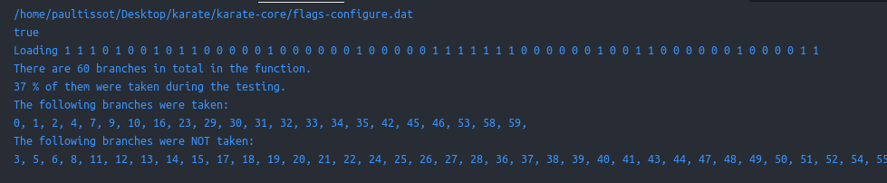
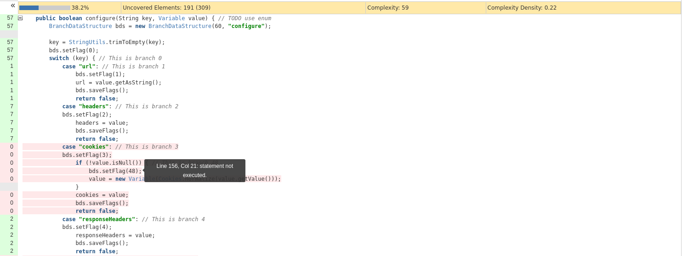)

**New coverage:**

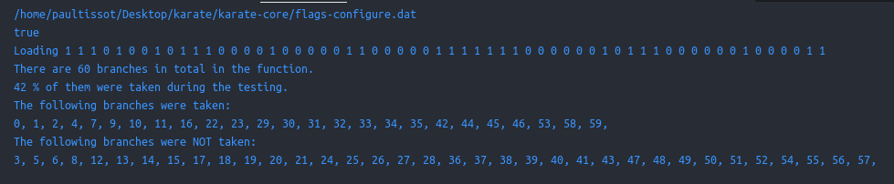
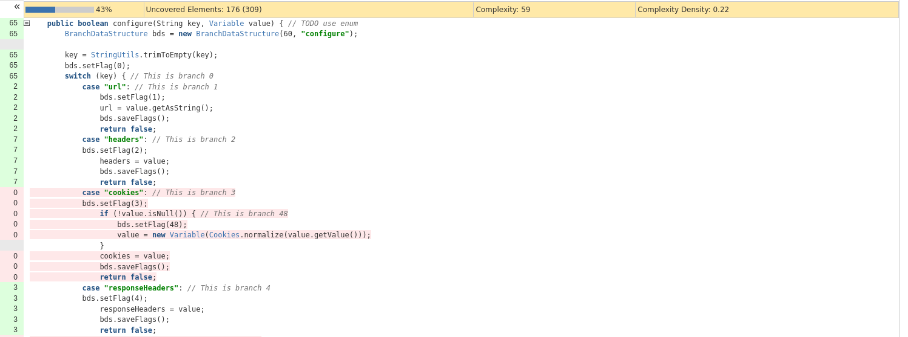


**Test cases added:**

We added the following 8 test cases

```json
// Requirement: the url needs to be set correctly
    @Test
    void testConfigureUrl() {        
        config.configure("url", new Variable("www.site.com"));
        assertEquals("www.site.com", config.getUrl());
    }

    // Requirement: the responseHeaders needs to be set correctly
    @Test
    void testConfigureResponseHeaders() {
        config.configure("responseHeaders", new Variable("header"));
        assertEquals("header", config.getResponseHeaders().getValue());
    }


    // Requirement: the nmtlAuth configuration should correctly unwrap the input Map
    @Test
    void testConfigureNtlmAuth1() {
        Map<String, Object> dummyMap = new HashMap<>();
        dummyMap.put("username", "dummyUsername");
        dummyMap.put("password", "dummyPassword");
        dummyMap.put("domain", "dummyDomain");
        dummyMap.put("workstation", "dummyWorkstation");
        config.configure("ntlmAuth", new Variable(dummyMap));
        assertEquals("dummyDomain", config.getNtlmDomain());
    }

    // Requirement: the ntlmAuth configuration should disable ntlm if the map is Null
    @Test
    void testConfigureNtlmAuth2() {
        config.configure("ntlmAuth", new Variable(null));
        assertEquals(null, config.getNtlmDomain());
    }

    // Requirement: the responseHeaders needs to be set correctly
    @Test
    void testLocalAddress() {
        config.configure("localAddress", new Variable("address"));
        assertEquals("address", config.getLocalAddress());
    }

    // Requirement: the lowerCaseResponseHeaders needs to be set correctly
    @Test
    void testLowerCaseResponseHeaders() {
        config.configure("lowerCaseResponseHeaders", new Variable(true));
        assertTrue(config.isLowerCaseResponseHeaders());
    }

    // Requirement: the printEnabled needs to be set correctly
    @Test
    void testPrintEnabled() {
        config.configure("printEnabled", new Variable(true));
        assertTrue(config.isPrintEnabled());
    }
    
    // Requirement: the pauseIfNotPerf needs to be set correctly
    @Test
    void testPauseIfNotPerf() {
        config.configure("pauseIfNotPerf", new Variable(true));
        assertTrue(config.isPauseIfNotPerf());
    }
```

### Request::getMember

**Old coverage:**

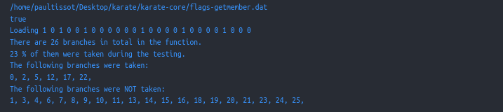
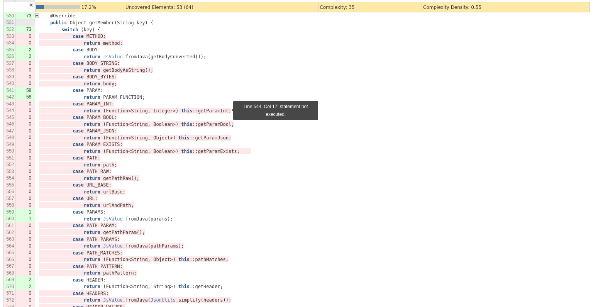

**New coverage:**

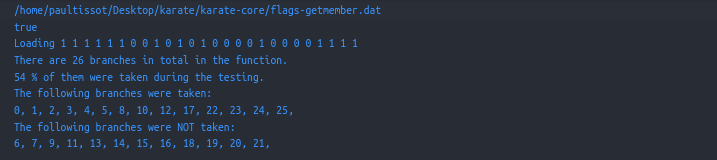
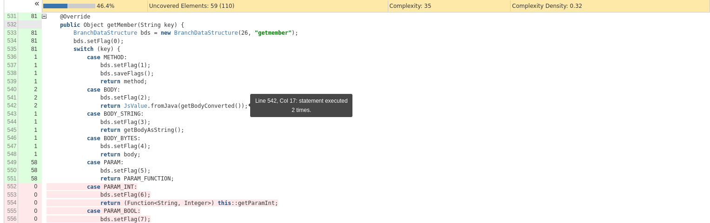

**Test cases added:**

We added the following 8 test cases:

```json
    // Requirement: the method needs to be set up correctly
    @Test
    void testMethod() {
        request.setMethod("test");
        assertEquals("test", request.getMember("method"));
    }

    // Requirement: the body needs to be set up correctly
    @Test
    void testBodyAsString() {
        byte[] body = "banana".getBytes();
        request.setBody(body);
        assertEquals("banana", request.getMember("bodyString"));
    }
    
    // Requirement: the body needs to be set up correctly
    @Test
    void testBodyAsBytes() {
        byte[] body = "banana".getBytes();
        request.setBody(body);
        assertEquals(body, request.getMember("bodyBytes"));
    }

    // Requirement: the URL base needs to be set up correctly
    @Test
    void testUrlBase() {
        request.setUrlBase("http://banana.com");
        assertEquals("http://banana.com", request.getMember("urlBase"));
    }

    // Requirement: the path needs to be set up correctly
    @Test
    void testPath() {
        request.setPath("thepath");
        assertEquals("/thepath", request.getMember("path"));
    }

    // Requirement: the input needs to be set up correctly
    @Test
    void testBadInput() {
        assertNull(request.getMember("banana"));
    }

    // Requirement: the start time needs to be set up correctly
    @Test
    void testStartTime(){
        request.setStartTime(100);
        assertEquals(100L, request.getMember("startTime"));
    }

    // Requirement: the end time needs to be set up correctly
    @Test
    void testEndTime(){
        request.setEndTime(200);
        assertEquals(200L, request.getMember("endTime"));
    }
```

### MockHandler:handle

**Old coverage:**

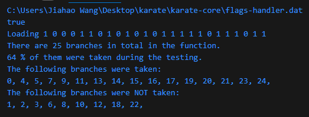
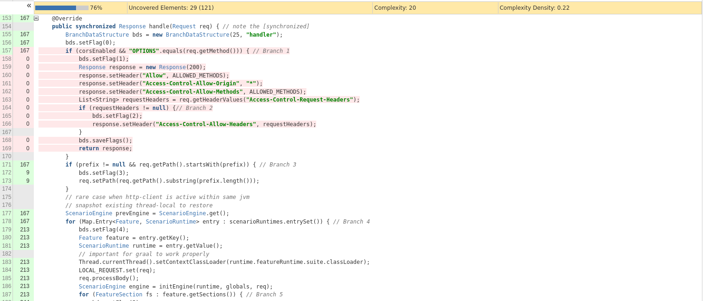

**New coverage:**

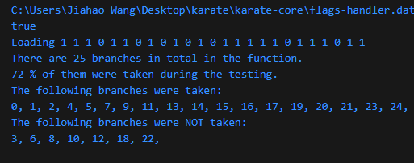
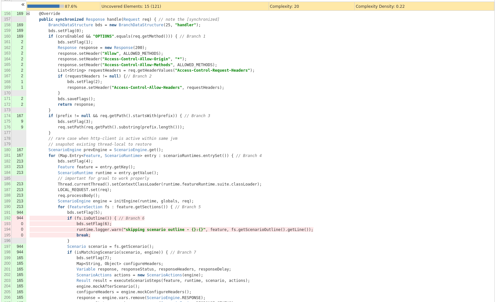

**Test cases added:**

2 test cases added.

```json
    // Author: Carl
    // Requirement: The CORS should be enable, and the method should be OPTIONS
    @Test
    void testCorsPreflight() {
        // Setup a CORS preflight request scenario
        background().scenario(
                "pathMatches('/hello')",
                "methodIs('options')",
                // Assuming the response setup includes CORS headers based on the incoming request
                "def responseHeaders = { 'Access-Control-Allow-Origin': '*', 'Access-Control-Allow-Methods': 'GET, POST, OPTIONS', 'Access-Control-Allow-Headers': 'Content-Type' }",
                "def response = {}" // An empty response body is assumed; adjust as needed
        );
        request.url("/hello")
        .method("OPTIONS");

        // Execute the handler with CORS enabled
        handle1(true);

        // Assert the response headers for CORS preflight
        // Using match function from Karate for assertions
        match(response.getHeader("Access-Control-Allow-Origin"), "*");
        match(response.getHeader("Access-Control-Allow-Methods"), "GET, HEAD, POST, PUT, DELETE, PATCH");
    }

     // Author: Carl
    // Requirement: The headers are not null;
    @Test
    void testNotNullHeaders() {
        // Setup a CORS preflight request scenario
        background().scenario(
                "pathMatches('/hello')",
                "methodIs('options')",
                // Assuming the response setup includes CORS headers based on the incoming request
                "def responseHeaders = { 'Access-Control-Allow-Origin': '*', 'Access-Control-Allow-Methods': 'GET, POST, OPTIONS', 'Access-Control-Allow-Headers': 'Content-Type' }",
                "def response = {}" // An empty response body is assumed; adjust as needed
        );
        request.url("/hello")
            .method("OPTIONS")
            .header("Access-Control-Request-Headers", "Content-Type");

        // Execute the handler with CORS enabled
        handle1(true);

        // Assert the response headers
        match(response.getHeader("Access-Control-Allow-Headers"), "Content-Type");
    } 
```

## Self-assessment: Way of working

In evaluating our way of working, we have seen large improvements within many aspects, compared to after lab 1. We found that the process of establishing the principles as well as the foundation of the new projects go much faster, as we have a better understanding of each member's schedules and how they prefer to work. This allows us to have effective start-up meetings, where we can focus entirely on the aspects related to the assignment, rather than on, for example, establishing standards of communication. In this lab, we decided on the “karate” git repo as our project to work on. Furthermore, we decided to use lizard as our tool to measure metrics and OpenClover as our code coverage tool. After that, we allowed members to freely choose which function they would like to work on, as long as its CCN was high enough. Overall, our self-assessment was unanimous.

After completing assignment 3, we believe that we are currently in the in place state. This is one state higher than in lab 1, where we evaluated ourselves to be in the in use state. One of the biggest improvements we’ve seen is in our commit messages, as this was previously a challenge for us. We feel that all team members have been much more consistent in their commit messages due to us establishing a clear structure to follow after assignment 1. In improving our commit messages, we have improved the communication and collaboration that takes place on github, as they simplify searching for issues and generally result in a “cleaner” and easier to understand repository.

The challenge we are currently facing is completing the last step in the in place state; “The whole team is involved in the inspection and adaptation of the way-of-working”. We feel that the practices we have established are used unanimously among the group. However, upon reflection, there is room for improvement when it comes to inspecting how our way-of-working can be affected by, for example, new assignments, as well as how we can better adapt to them. 

## Overall experience

What are your main take-aways from this project? What did you learn?

Is there something special you want to mention here?